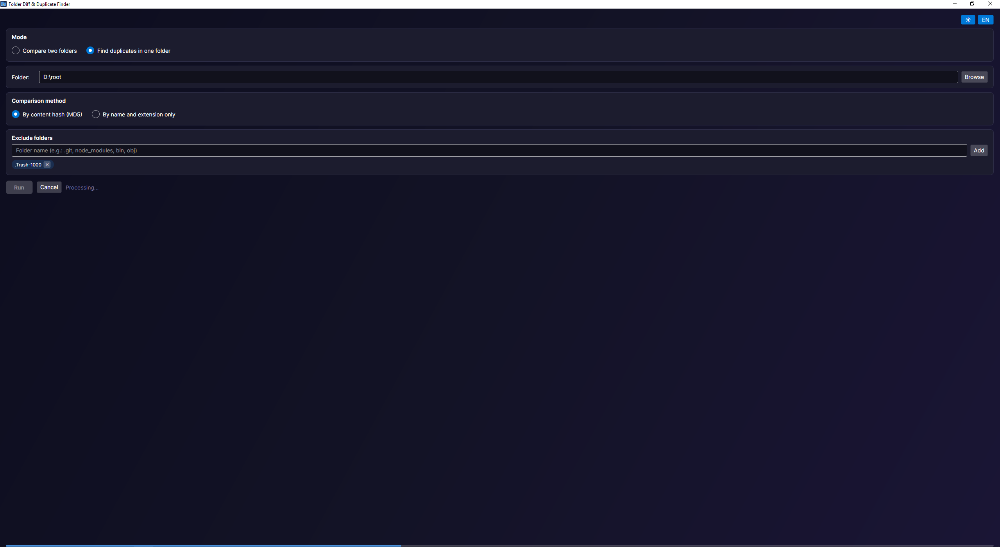
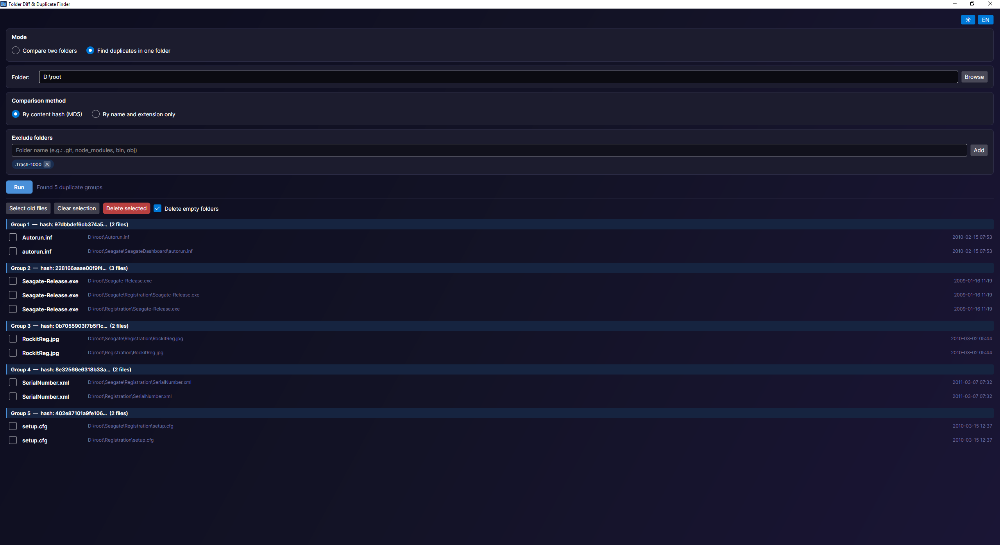

<p align="center">
  
</p>

<h1 align="center">FolderDiff</h1>

<p align="center">
  <a href="https://github.com/donzasto/FolderDiff/releases/latest">
    
  </a>
  
  
  
</p>

<br/>

<p align="center"><i>Compare folders and find duplicate files</i></p>

<p align="center">UI is available in English and Russian</p>

<p align="center">
  
  &nbsp;
  
</p>

<br/>

### Download

<p align="center">
  <a href="https://github.com/donzasto/FolderDiff/releases/latest/download/FolderDiff-win-x64.zip">
    
  </a>
  &nbsp;
  <a href="https://github.com/donzasto/FolderDiff/releases/latest/download/FolderDiff-linux-x64.tar.gz">
    
  </a>
  &nbsp;
  <a href="https://github.com/donzasto/FolderDiff/releases/latest/download/FolderDiff-osx-x64.tar.gz">
    
  </a>
</p>

<p align="center">
  <a href="https://github.com/donzasto/FolderDiff/releases">All releases →</a>
</p>

<br/>

### Features

**Modes**

| | Mode | Description |
|---|---|---|
| 📁 | **Compare two folders** | Finds files that differ in content or are missing from one of the folders |
| 🔍 | **Find duplicates** | Searches for identical files inside a selected folder and all its subfolders |

**Comparison methods**

| | Method | Description |
|---|---|---|
| #️⃣ | **By hash (MD5)** | Exact byte-level comparison — slower but reliable |
| 🏷️ | **By name** | Fast check without reading file contents |

**Working with results**
- Checkboxes next to each found file
- **Select old files** — marks all copies except the newest (by modification date)
- **Delete selected** — deletes checked files from disk
- **Delete empty folders** — after deletion, cleans up empty folders recursively

**Exclusions** — folder names to skip during scanning (`.git`, `node_modules`, `bin`, `obj`, etc.)

### Build & run

```bash
dotnet build
dotnet run --project FolderDiff.Desktop
```
